# Transformação Linear Definida por Partes e Fatiamento de Níveis de Intensidade

***Objetivo***: Compreender e aplicar técnicas de transformação linear por partes e fatiamento de níveis de intensidade em imagens, explorando a capacidade de manipular faixas específicas de intensidade para destacar ou suprimir detalhes em imagens médicas.

# Metodologia e Implementação

## Configurações do Projeto

Nesta seção, instalamos as bibliotecas necessárias para o projeto, incluindo `pandas`, `matplotlib`, `opencv-python` e `numpy`. Estas bibliotecas são fundamentais para manipulação de imagens, visualização de dados e cálculos numéricos.


```python
!pip install pandas matplotlib opencv-python numpy
```


```python
import cv2
import numpy as np
import matplotlib.pyplot as plt


def calcular_histograma(imagem):    
    histograma = np.zeros(256, dtype=int)
        
    for valor in imagem.flatten():  
        histograma[valor] += 1  
    
    return histograma
```

## Carregar e Exibir a Imagem Original

Aqui, carregamos uma imagem em tons de cinza usando a função cv2.imread() do OpenCV. Em seguida, a imagem é exibida utilizando a biblioteca matplotlib, permitindo visualizar o conteúdo da imagem original.


```python
image = cv2.imread('images/graos_polen.tif', cv2.IMREAD_GRAYSCALE)

plt.figure(figsize=(15, 6))
plt.subplot(1, 3, 1)
plt.imshow(image, cmap='gray', vmin=0, vmax=255)  
plt.title('Imagem Original')
plt.axis('off')

```


    (np.float64(-0.5), np.float64(888.5), np.float64(888.5), np.float64(-0.5))


    
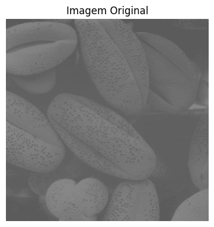
    


## Equalização de Histograma Manual

A equalização de histograma é um método utilizado para melhorar o contraste de uma imagem. Nesta parte do código, comparamos a implementação da equalização de histograma manual com a função equalizeHist() do OpenCV. O objetivo é mostrar como diferentes abordagens podem resultar em imagens com melhor contraste, permitindo ao usuário observar a eficácia da técnica.

***manual_histograma_equalizacao***: A função realiza a equalização de histograma de forma manual. Primeiro, o histograma da imagem é calculado e normalizado para obter a distribuição de probabilidade de intensidade. Em seguida, a função calcula a função de distribuição acumulada (CDF), que é usada para redistribuir os níveis de intensidade da imagem, expandindo o contraste da imagem original. O resultado é uma imagem com maior contraste, onde as intensidades são redistribuídas para ocupar a faixa completa de 0 a 255, melhorando a visibilidade dos detalhes.


```python
def manual_histograma_equalizacao(image):
    
    hist, bins = np.histogram(image.flatten(), 256, [0, 256])

    hist_normalized = hist / hist.sum()

    cdf = hist_normalized.cumsum()  
    cdf_normalized = (255 * cdf).astype(np.uint8)  
    image_equalized = cdf_normalized[image]

    return image_equalized


image = cv2.imread('images/graos_polen.tif', cv2.IMREAD_GRAYSCALE)
imagem_equalizada_manual = manual_histograma_equalizacao(image)

plt.figure(figsize=(14, 10))

plt.subplot(2, 2, 1)
plt.imshow(image, cmap='gray', vmin=0, vmax=255)
plt.title('Imagem Original')
plt.axis('off')

plt.subplot(2, 2, 2)
plt.plot(calcular_histograma(image), color='black')
plt.title('Histograma Original')
plt.xlabel('Intensidade de Pixel')
plt.ylabel('Número de Pixels')

plt.subplot(2, 2, 3)
plt.imshow(imagem_equalizada_manual, cmap='gray', vmin=0, vmax=255)
plt.title('Imagem Equalizada')
plt.axis('off')

plt.subplot(2, 2, 4)
plt.plot(calcular_histograma(imagem_equalizada_manual), color='black')
plt.title('Histograma Equalizado')
plt.xlabel('Intensidade de Pixel')
plt.ylabel('Número de Pixels')

plt.tight_layout()
plt.show()

```


    
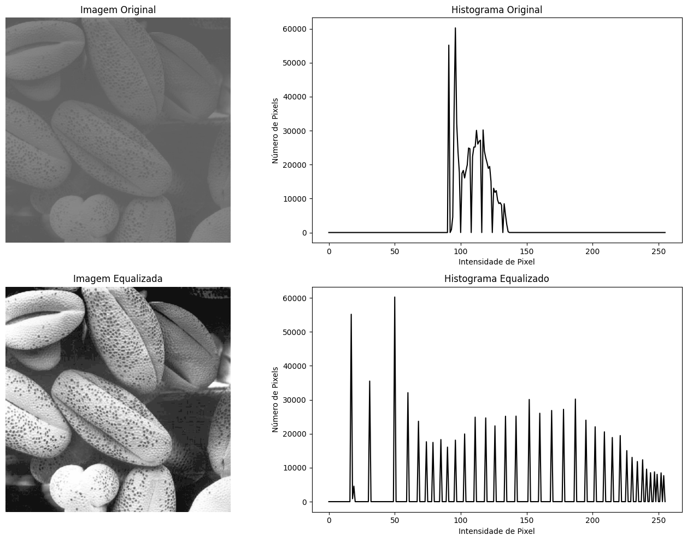
    


## Limiarização Manual de Imagem

Nesta seção, implementamos uma função para realizar a limiarização manual de uma imagem. A limiarização é um método simples de segmentação que transforma uma imagem em preto e branco com base em um valor de limiar definido. Também comparamos a nossa implementação com a função de limiarização do OpenCV.

***manual_threshold***: Essa função implementa a técnica de limiarização manual em uma imagem. Para cada pixel da imagem, a função compara sua intensidade com um valor de limiar (threshold_value). Se a intensidade do pixel for maior que o limiar, o pixel é definido como branco (valor 255); caso contrário, é definido como preto (valor 0). O resultado é uma imagem binária, onde os objetos ou áreas de interesse são destacados com base no valor de limiar definido.


```python
def manual_threshold(image, threshold_value):
    
    limiarizada = np.zeros_like(image)
    
    for i in range(image.shape[0]):  
        for j in range(image.shape[1]):  
            
            if image[i, j] > threshold_value:
                limiarizada[i, j] = 255  
            else:
                limiarizada[i, j] = 0  
    
    return limiarizada

image = cv2.imread('images/graos_polen.tif', cv2.IMREAD_GRAYSCALE)

threshold_value = 107  
limiarizada_manual = manual_threshold(image, threshold_value)


plt.figure(figsize=(14, 10))


plt.subplot(2, 2, 1)
plt.imshow(image, cmap='gray', vmin=0, vmax=255)
plt.title('Imagem Original')
plt.axis('off')


plt.subplot(2, 2, 2)
plt.plot(calcular_histograma(image), color='black')
plt.title('Histograma Original')
plt.xlabel('Intensidade de Pixel')
plt.ylabel('Número de Pixels')


plt.subplot(2, 2, 3)
plt.imshow(limiarizada_manual, cmap='gray', vmin=0, vmax=255)
plt.title('Imagem Limiarizada')
plt.axis('off')


plt.subplot(2, 2, 4)
plt.plot(calcular_histograma(limiarizada_manual), color='black')
plt.title('Histograma Limiarizada')
plt.xlabel('Intensidade de Pixel')
plt.ylabel('Número de Pixels')

plt.tight_layout()
plt.show()
```


    
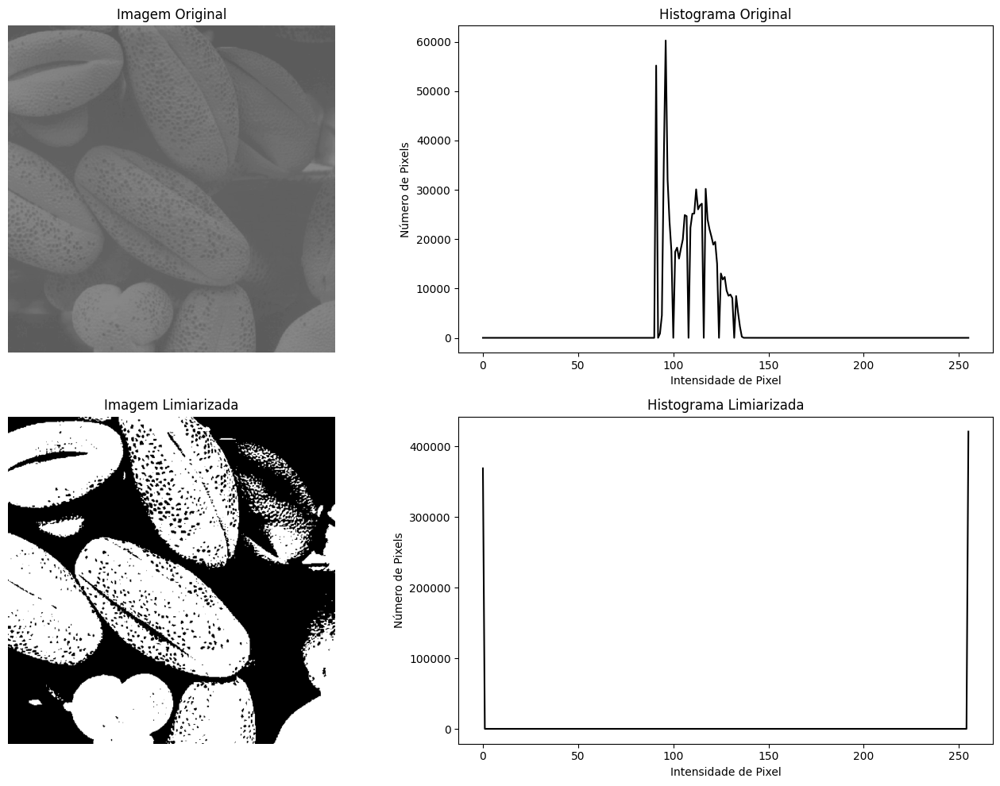
    


## Fatiamento de Imagem

Nesta seção, implementamos funções para realizar o fatiamento de imagens. O fatiamento é uma técnica que permite realçar ou isolar partes específicas de uma imagem com base em valores de intensidade. Apresentamos duas abordagens: o fatiamento binário e o fatiamento preservando intensidades.


```python
imagem = cv2.imread('images/angiograma_aorta.tif', cv2.IMREAD_GRAYSCALE)

def fatiamento_binario(imagem, A, B):    
    mascara = (imagem >= A) & (imagem <= B)  
    imagem_fatiada = np.zeros_like(imagem)       
    imagem_fatiada[mascara] = 255
    
    return imagem_fatiada

def fatiamento_preservando_intensidade(imagem, A, B):
    imagem_ajustada = np.copy(imagem)
    imagem_ajustada[(imagem < A) | (imagem > B)] = (imagem_ajustada[(imagem < A) | (imagem > B)] * 0.2).astype(np.uint8)
        
    return imagem_ajustada


```

- ***fatiamento_binario***: Essa função realiza um fatiamento binário da imagem. Ela identifica os pixels cuja intensidade está entre os limites A e B e cria uma máscara para selecionar esses pixels. A função gera uma nova imagem onde os pixels dentro desse intervalo são transformados em branco (valor 255), enquanto todos os outros pixels fora desse intervalo são convertidos para preto (valor 0). O resultado é uma imagem binária destacando claramente os níveis de intensidade entre A e B.

- ***fatiamento_preservando_intensidade***: A função de fatiamento preservando intensidade modifica os pixels da imagem com base em um intervalo de intensidades definido pelos valores A e B. Nesse processo, os pixels dentro desse intervalo permanecem inalterados, preservando suas intensidades originais. No entanto, os pixels fora do intervalo são reduzidos para 20% de sua intensidade original, o que diminui o impacto visual desses pixels, destacando apenas a faixa de intensidades desejada sem removê-los completamente.

## Aplicar Fatiamento na Imagem do Angiograma

Por fim, aplicamos as técnicas de fatiamento na imagem do angiograma e exibimos as imagens resultantes, juntamente com os histogramas correspondentes. Essa análise ajuda a visualizar como o fatiamento afeta as intensidades de pixel na imagem.


```python
imagem_fatiada_binaria = fatiamento_binario(imagem, 145, 250)
imagem_fatiada_preservada = fatiamento_preservando_intensidade(imagem, 150, 255)

fig, axs = plt.subplots(3, 2, figsize=(15, 15))

axs[0, 0].imshow(imagem, cmap='gray', vmin=0, vmax=255)
axs[0, 0].set_title('Imagem Original')
axs[0, 0].axis('off')

hist_original = calcular_histograma(imagem)
axs[0, 1].plot(hist_original, color='black')
axs[0, 1].set_title('Histograma da Imagem Original')
axs[0, 1].set_xlim([0, 256])
axs[0, 1].set_xlabel('Níveis de Intensidade')
axs[0, 1].set_ylabel('Número de Pixels')

axs[1, 0].imshow(imagem_fatiada_binaria, cmap='gray', vmin=0, vmax=255)
axs[1, 0].set_title('Fatiamento Binário')
axs[1, 0].axis('off')

hist_binario = calcular_histograma(imagem_fatiada_binaria)
axs[1, 1].plot(hist_binario, color='black')
axs[1, 1].set_title('Histograma Fatiamento Binário')
axs[1, 1].set_xlim([0, 256])
axs[1, 1].set_xlabel('Níveis de Intensidade')
axs[1, 1].set_ylabel('Número de Pixels')

axs[2, 0].imshow(imagem_fatiada_preservada, cmap='gray', vmin=0, vmax=255)
axs[2, 0].set_title('Fatiamento Preservando Intensidades')
axs[2, 0].axis('off')

hist_preservada = calcular_histograma(imagem_fatiada_preservada)
axs[2, 1].plot(hist_preservada, color='black')
axs[2, 1].set_title('Histograma Fatiamento Preservando Intensidades')
axs[2, 1].set_xlim([0, 256])
axs[2, 1].set_xlabel('Níveis de Intensidade')
axs[2, 1].set_ylabel('Número de Pixels')

plt.tight_layout()
plt.show()

```


    
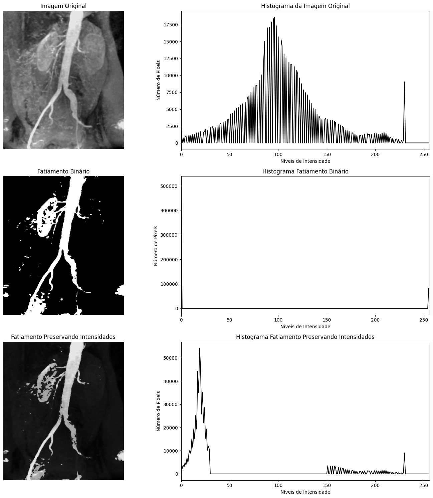
    


# Discussão sobre os resultados

**Transformação Linear Definida por Partes:** Mostra-se eficaz para destacar determinadas faixas de intensidade, útil em cenários como realce de objetos de interesse em imagens médicas. No entanto, o controle manual de faixas pode resultar em perda de detalhes em outras regiões.

**Fatiamento de Níveis de Intensidade:** Demonstrou ser uma técnica poderosa para isolar estruturas de interesse, como visto no angiograma. Ao suprimir certas faixas de intensidade, informações irrelevantes foram removidas, realçando apenas a área de interesse.

Concluindo, ambas as técnicas são eficazes, mas devem ser usadas com cautela, conforme o objetivo específico, já que podem ocultar detalhes importantes ao modificar intensidades fora da faixa de interesse.


# Secao 2: Especificação e Equalização de Histogramas na Prática

## Configurações do Projeto e Funções úteis


```python
import cv2
import numpy as np
import matplotlib.pyplot as plt

def calcular_histograma(imagem):    
    histograma = np.zeros(256, dtype=int)
        
    for valor in imagem.flatten():  
        histograma[valor] += 1  
    
    return histograma

```

## Equalização de Histograma

A equalização de histograma é um método que redistribui a intensidade dos pixels de uma imagem para melhorar o contraste. Esse processo é útil em situações onde a imagem tem pouca variação de intensidade, facilitando a visualização de detalhes.


```python
def equalizar_histograma(imagem):    
    histograma = calcular_histograma(imagem)
    
    cdf = histograma.cumsum()  
    cdf_normalizado = cdf * (255 / cdf[-1])  
    
    imagem_equalizada = np.interp(imagem.flatten(), np.arange(256), cdf_normalizado)  
    imagem_equalizada = imagem_equalizada.reshape(imagem.shape)  

    return imagem_equalizada.astype(np.uint8)

```

- ***Cálculo do Histograma:*** Chama a função calcular_histograma para obter o histograma da imagem original.
- ***Cálculo da Função de Distribuição Acumulada (CDF):*** Utiliza` cumsum()` para calcular a soma cumulativa do histograma, resultando em uma CDF que indica a frequência acumulada de cada nível de intensidade.
- ***Normalização da CDF:*** A CDF é normalizada para o intervalo de 0 a 255. Isso assegura que a nova distribuição de intensidades de pixel se adapte à gama completa de valores de intensidade.
- ***Interpolação:*** A função `np.interp` é usada para mapear os valores de pixel da imagem original para a nova distribuição normalizada.
- ***Reformatação da Imagem:*** A imagem equalizada é reformulada para suas dimensões originais e convertida para o tipo uint8.


```python

imagem = cv2.imread('images/lua_marte.tif', cv2.IMREAD_GRAYSCALE)

imagem_equalizada = equalizar_histograma(imagem)

plt.figure(figsize=(14, 10))


plt.subplot(2, 2, 1)
plt.imshow(imagem, cmap='gray', vmin=0, vmax=255)
plt.title('Imagem Original')
plt.axis('off')


plt.subplot(2, 2, 2)
plt.plot(calcular_histograma(imagem), color='black')
plt.title('Histograma Original')
plt.xlabel('Intensidade de Pixel')
plt.ylabel('Número de Pixels')


plt.subplot(2, 2, 3)
plt.imshow(imagem_equalizada, cmap='gray', vmin=0, vmax=255)
plt.title('Imagem Equalizada')
plt.axis('off')


plt.subplot(2, 2, 4)
plt.plot(calcular_histograma(imagem_equalizada), color='black')
plt.title('Histograma Equalizado')
plt.xlabel('Intensidade de Pixel')
plt.ylabel('Número de Pixels')

plt.tight_layout()
plt.show()

```


    
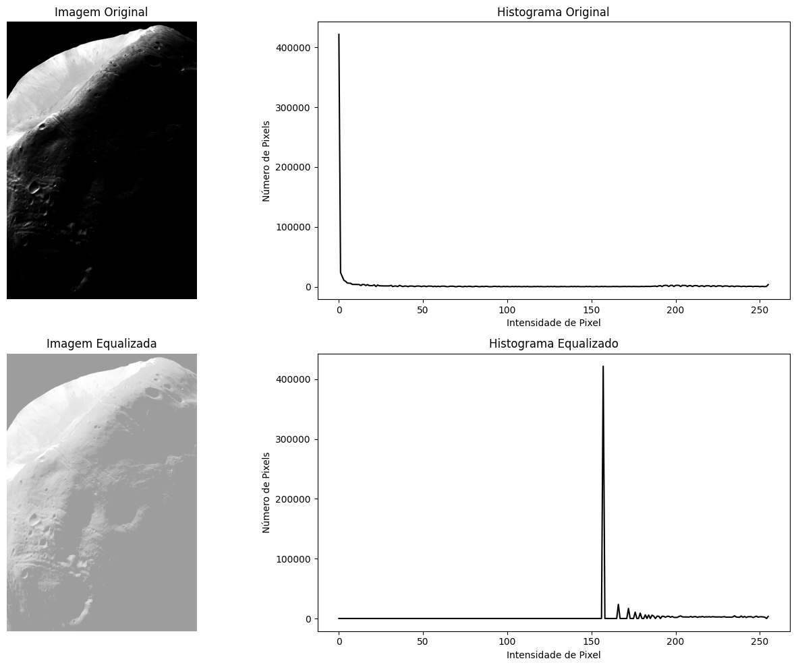
    


## Especificação de Histograma

Ao contrário da equalização, a especificação de histograma ajusta a distribuição de intensidades da imagem original de forma controlada, suavizando as transições entre diferentes níveis de intensidade, especialmente nas áreas escuras.


```python


def especificar_histograma_manual(imagem):    
    funcao_transformacao = np.zeros(256, dtype=float)    
    
    for i in range(256):
        if i < 10:
            funcao_transformacao[i] = i * 10 
        elif i < 64:
            funcao_transformacao[i] = i * 2.5 
        elif i < 128:
            funcao_transformacao[i] = i* 1.3  
        else:
            funcao_transformacao[i] = i * 1.1      
    
    funcao_transformacao = np.clip(funcao_transformacao, 0, 255) 
    imagem_especificada = np.interp(imagem.flatten(), np.arange(256), funcao_transformacao)    
    
    return imagem_especificada.reshape(imagem.shape).astype(np.uint8)

imagem = cv2.imread('images/lua_marte.tif', cv2.IMREAD_GRAYSCALE)
imagem_especificada = especificar_histograma_manual(imagem)

plt.figure(figsize=(12, 8))

plt.subplot(2, 2, 1)
plt.imshow(imagem, cmap='gray', vmin=0, vmax=255)
plt.title('Imagem Original')
plt.axis('off')

plt.subplot(2, 2, 2)
plt.plot(calcular_histograma(imagem), color='black')
plt.title('Histograma Original')

plt.subplot(2, 2, 3)
plt.imshow(imagem_especificada, cmap='gray', vmin=0, vmax=255)
plt.title('Imagem com Especificação de Histograma')
plt.axis('off')

plt.subplot(2, 2, 4)
plt.plot(calcular_histograma(imagem_especificada), color='black')
plt.title('Histograma Especificado')

plt.tight_layout()
plt.show()

```


    
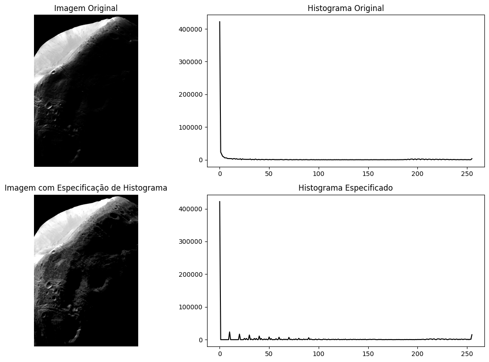
    


### Processo de especificação do Histograma

A função `especificar_histograma_manual` é projetada para ajustar a intensidade dos pixels de uma imagem em escala de cinza de maneira controlada. A função define transformações específicas para diferentes faixas de intensidade: 
- Para intensidades abaixo de `64`, a transformação é `i * 2`, o que ilumina as áreas escuras;
- Para intensidades entre `64` e `127`, `i * 1.3` é aplicado, o que suaviza e aumenta os tons médios; 
- Para intensidades acima de `128`, `i * 1.1` é utilizado, resultando em um leve aumento na intensidade das áreas mais claras.

 Depois de definir a transformação, a função utiliza `np.clip` para garantir que os valores resultantes permaneçam dentro do intervalo permitido (0 a 255). Por fim, a transformação é aplicada à imagem usando `np.interp`, que mapeia os valores de pixel originais para os novos valores especificados, retornando a imagem resultante em sua forma original e convertida para o tipo `uint8`. Essa abordagem resulta em uma imagem que preserva a estrutura original do histograma enquanto suaviza as transições e melhora a iluminação geral.

## Comparando as 3 imagens


```python
plt.figure(figsize=(12, 12))

plt.subplot(1, 3, 1)
plt.imshow(imagem, cmap='gray', vmin=0, vmax=255)
plt.title('Imagem Original')
plt.axis('off')

plt.subplot(1, 3, 2)
plt.imshow(imagem_equalizada, cmap='gray', vmin=0, vmax=255)
plt.title('Imagem Equalizada')
plt.axis('off')

plt.subplot(1, 3, 3)
plt.imshow(imagem_especificada, cmap='gray', vmin=0, vmax=255)
plt.title('Imagem Especificada')
plt.axis('off')

plt.tight_layout()
plt.show()
```


    
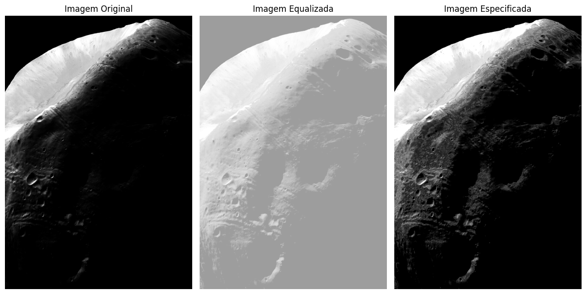
    


## Discussão e resultados

A ***equalização*** de histograma melhora o contraste redistribuindo as intensidades, mas pode desbotar a imagem, especialmente em áreas escuras. Em caso onde a imagem seja muito escura com o histograma tendendo para o lado esquerdo, a equalização pode clarear em demasia a imagem.

A ***especificação*** de histograma, por sua vez, oferece um controle mais preciso, permitindo ajustar o histograma de forma personalizada, preservando detalhes nas sombras sem comprometer as áreas claras. Isso a torna mais eficaz em cenários que exigem ajustes mais sutis, como em imagens de segurança e médicas.


# Secao 3: Especificação de Histograma em PDI com Imagem Própria

## Configurações do Projeto e Funções úteis


```python
import cv2
import numpy as np
import matplotlib.pyplot as plt

def calcular_histograma(imagem):    
    histograma = np.zeros(256, dtype=int)
        
    for valor in imagem.flatten():  
        histograma[valor] += 1  
    
    return histograma


```

## Carregando a imagem a ser utilizada


```python
imagem_propria = cv2.imread('images/imagem_propria.jpg', cv2.IMREAD_GRAYSCALE)

plt.figure(figsize=(15, 6))
plt.subplot(1, 3, 1)
plt.imshow(imagem_propria, cmap='gray', vmin=0, vmax=255)  
plt.title('Imagem Original')
plt.axis('off')

```


    (np.float64(-0.5), np.float64(2135.5), np.float64(3206.5), np.float64(-0.5))


    
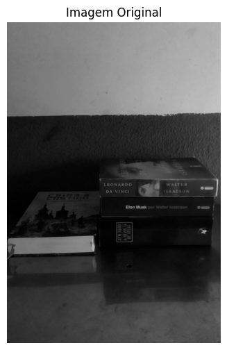
    


```python
plt.figure(figsize=(14, 10))
def equalizar_histograma(imagem):    
    histograma = calcular_histograma(imagem)
    
    cdf = histograma.cumsum()  
    cdf_normalizado = cdf * (255 / cdf[-1])  
    
    imagem_equalizada = np.interp(imagem.flatten(), np.arange(256), cdf_normalizado)  
    imagem_equalizada = imagem_equalizada.reshape(imagem.shape)  

    return imagem_equalizada.astype(np.uint8)
imagem_propria_equalizada = equalizar_histograma(imagem_propria)

plt.subplot(2, 2, 1)
plt.imshow(imagem_propria, cmap='gray', vmin=0, vmax=255)
plt.title('Imagem Original')
plt.axis('off')

plt.subplot(2, 2, 2)
plt.plot(calcular_histograma(imagem_propria), color='black')
plt.title('Histograma Original')
plt.xlabel('Intensidade de Pixel')
plt.ylabel('Número de Pixels')

plt.subplot(2, 2, 3)
plt.imshow(imagem_propria_equalizada, cmap='gray', vmin=0, vmax=255)
plt.title('Imagem Equalizada')
plt.axis('off')

plt.subplot(2, 2, 4)
plt.plot(calcular_histograma(imagem_propria_equalizada), color='black')
plt.title('Histograma Equalizado')
plt.xlabel('Intensidade de Pixel')
plt.ylabel('Número de Pixels')

plt.tight_layout()
plt.show()

```


    
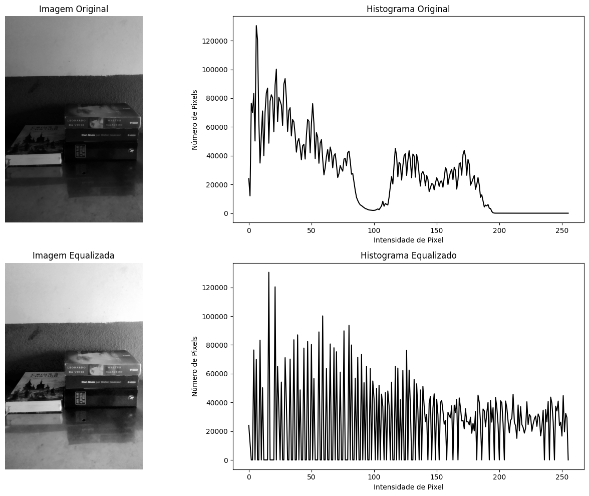
    


```python

def especificar_histograma_manual_propria(imagem):    
    funcao_transformacao = np.zeros(256, dtype=float)   
    
    for i in range(256):
        if i < 20:
            funcao_transformacao[i] = i * 2.3 
        elif i < 64:
            funcao_transformacao[i] = i* 1.9  
        elif i < 128:
            funcao_transformacao[i] = i* 1.6  
        else:
            funcao_transformacao[i] = i * 1.6      
    
    funcao_transformacao = np.clip(funcao_transformacao, 0, 255)      
    imagem_especificada = np.interp(imagem.flatten(), np.arange(256), funcao_transformacao)    
    
    return imagem_especificada.reshape(imagem.shape).astype(np.uint8)

imagem_propria_especificada = especificar_histograma_manual_propria(imagem_propria)

plt.figure(figsize=(14, 10))

plt.subplot(2, 2, 1)
plt.imshow(imagem_propria, cmap='gray', vmin=0, vmax=255)
plt.title('Imagem Original')
plt.axis('off')

plt.subplot(2, 2, 2)
plt.plot(calcular_histograma(imagem_propria), color='black')
plt.title('Histograma Original')

plt.subplot(2, 2, 3)
plt.imshow(imagem_propria_especificada, cmap='gray', vmin=0, vmax=255)
plt.title('Imagem com Especificação de Histograma')
plt.axis('off')

plt.subplot(2, 2, 4)
plt.plot(calcular_histograma(imagem_propria_especificada), color='black')
plt.title('Histograma Especificado')

plt.tight_layout()
plt.show()

```


    
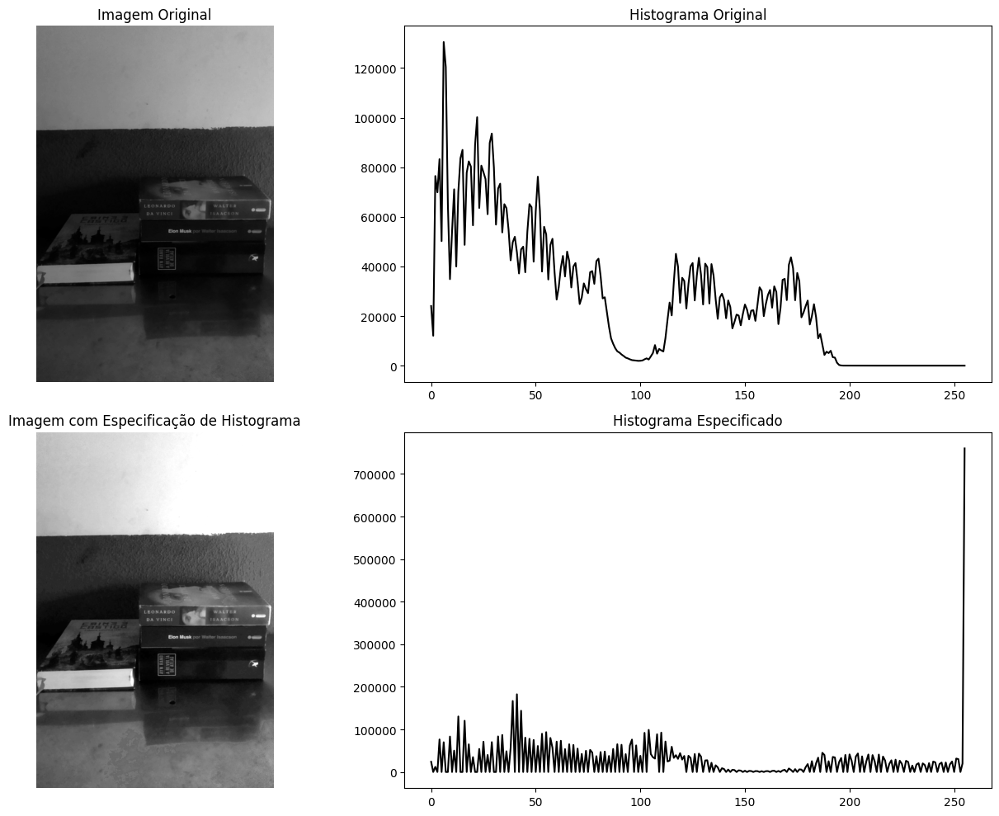
    


## Comparando as 3 imagens próprias


```python
plt.figure(figsize=(12, 12))

plt.subplot(1, 3, 1)
plt.imshow(imagem_propria, cmap='gray', vmin=0, vmax=255)
plt.title('Imagem Original')
plt.axis('off')

plt.subplot(1, 3, 2)
plt.imshow(imagem_propria_equalizada, cmap='gray', vmin=0, vmax=255)
plt.title('Imagem Equalizada')
plt.axis('off')

plt.subplot(1, 3, 3)
plt.imshow(imagem_propria_especificada, cmap='gray', vmin=0, vmax=255)
plt.title('Imagem Especificada')
plt.axis('off')

plt.tight_layout()
plt.show()
```


    
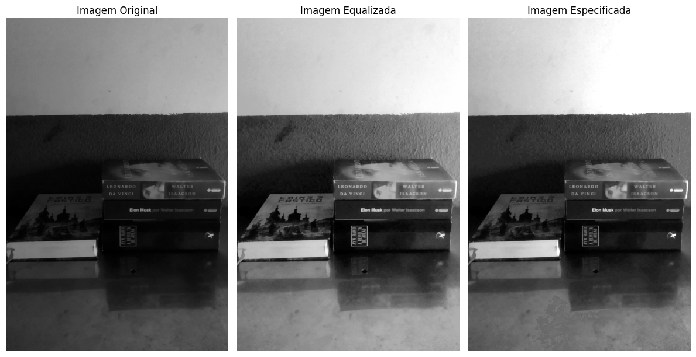
    


# Discussão sobre os resultados

- A ***equalização*** de histograma melhora o contraste, tornando áreas escuras mais visíveis, mas pode clarear excessivamente especialmente em cenas com grande variação de iluminação. Como podemos ver a segunda iamgem clareou excessivamente a imagem toda em si

- Já a ***especificação*** de histograma oferece um controle mais refinado, preservando a estrutura original e suavizando transições de tons. Essa técnica realça detalhes nas sombras sem distorcer áreas claras, sendo ideal para capturas naturais, como fotos de celular, onde é necessário um equilíbrio mais sutil entre áreas escuras e iluminadas como podemos ver na terceira imagem.

Concluindo, a especificação de histograma é a técnica preferível em situações onde se deseja melhorar detalhes em áreas escuras sem sacrificar a integridade das áreas mais claras. Já a equalização pode ser útil quando a prioridade é maximizar o contraste geral em uma imagem muito escura, embora com o risco de perder sutilezas em tons mais brilhantes. 


# Seção 4: Filtro de Tamanho Arbitrário

O objetivo desta seção é implementar filtros de tamanho arbitrário n×n em Python, usando diferentes tipos de padding e explorar como diferentes funções de filtro (por exemplo, filtros Gaussianos para suavização e filtros Laplacianos para aguçamento) afetam as características da imagem. 

# Metodologia e Implementação

### Configurações do Projeto e Funções úteis


```python
import cv2
import numpy as np
import matplotlib.pyplot as plt

def calcular_histograma(imagem):    
    histograma = np.zeros(256, dtype=int)
        
    for valor in imagem.flatten():  
        histograma[valor] += 1  
    
    return histograma


```

## Implementação do Filtro com Tamanho Arbitrário:

O objetivo desta implementação é aplicar um filtro de tamanho arbitrário em uma imagem em escala de cinza. O filtro permite suavizar a imagem e reduzir o ruído, utilizando uma matriz de coeficientes que define como os pixels vizinhos devem influenciar o pixel central. Neste exemplo, um filtro de 7x5 é aplicado a uma imagem ruidosa gerada por meio da adição de ruído gaussiano.

Nesta implementação, uma função `aplicar_filtro_arbitrario` foi criada para aplicar o filtro à imagem. A função calcula a soma ponderada dos pixels na vizinhança de cada pixel, conforme definido pela matriz do filtro, e garante que o resultado permaneça dentro do intervalo válido de intensidades de pixel. Após a aplicação do filtro, a imagem filtrada é exibida ao lado da imagem original, demonstrando a eficácia do filtro na suavização e na redução de ruído. A abordagem é flexível e pode ser adaptada para usar diferentes tamanhos e formas de filtros.


```python
import numpy as np
import cv2
import matplotlib.pyplot as plt

def aplicar_filtro_arbitrario(image, filter_matrix):
    M, N = image.shape    
    K = filter_matrix.shape[1] // 2
    L = filter_matrix.shape[0] // 2
    
    filtered_image = np.zeros_like(image)    
    scale_factor = 1.0 / np.sum(filter_matrix)
    
    for u in range(K, M - K):
        for v in range(L, N - L):            
            sum_result = 0
            for i in range(-K, K + 1):
                for j in range(-L, L + 1):
                    
                    pixel_value = image[u + i, v + j]                    
                    filter_value = filter_matrix[j + L, i + K]
                    sum_result += pixel_value * filter_value
            
            result = int(round(scale_factor * sum_result))
            result = np.clip(result, 0, 255)  
            filtered_image[u, v] = result
            
    return filtered_image

image = cv2.imread('images/galaxy.tif', cv2.IMREAD_GRAYSCALE)

def soma_ruido_gaussiano(I, sigma):
    h, w = I.shape
    noise = np.random.normal(0, sigma, (h, w))
    I += noise
    return np.clip(I, 0, 255)

image_float = image.astype(np.float32) / 255.0
noisy_image = soma_ruido_gaussiano(image_float, 0.1) * 255
noisy_image = noisy_image.astype(np.uint8)

filter_matrix = np.array([
    [0, 0, 1, 1, 1, 0, 0],
    [0, 1, 1, 1, 1, 1, 0],
    [1, 1, 1, 1, 1, 1, 1],
    [0, 1, 1, 1, 1, 1, 0],
    [0, 0, 1, 1, 1, 0, 0]
])

filtered_image = aplicar_filtro_arbitrario(noisy_image, filter_matrix)

plt.figure(figsize=(12, 6))
plt.subplot(1, 2, 1)
plt.title('Imagem Original')
plt.imshow(noisy_image, cmap='gray')
plt.axis('off')

plt.subplot(1, 2, 2)
plt.title('Imagem Filtrada')
plt.imshow(filtered_image, cmap='gray')
plt.axis('off')

plt.show()

```


    
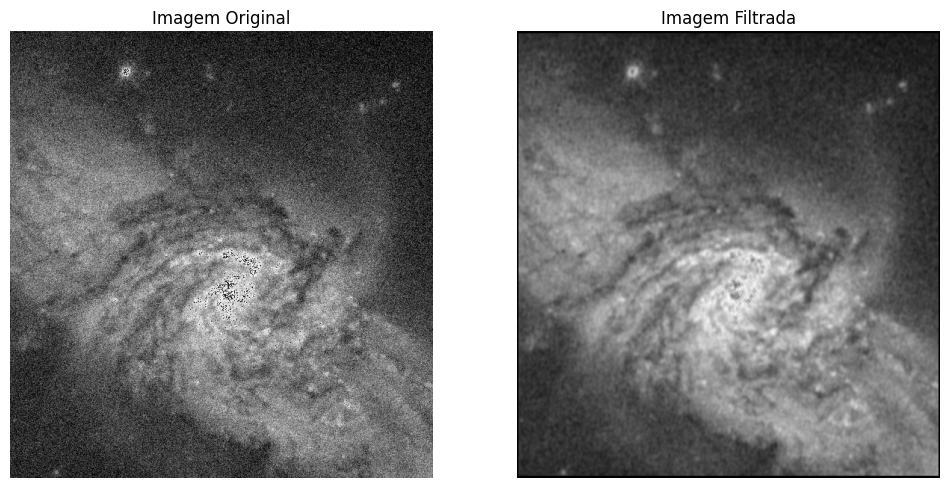
    


## Filtro Gaussiano

O filtro gaussiano é um filtro de suavização que utiliza uma função gaussiana para calcular os pesos dos pixels na vizinhança. Ao contrário do filtro de média, o filtro gaussiano dá mais peso aos pixels que estão mais próximos do pixel central, o que resulta em uma suavização mais natural e menos distorcida.

A função `gaussian_filter` cria uma matriz de filtro gaussiano, que é comumente utilizada em processamento de imagens para suavização e redução de ruído. Ela recebe dois parâmetros: `size`, que define a dimensão da matriz (tamanho do filtro), e `sigma`, que determina a largura da distribuição gaussiana. A função começa gerando um vetor `ax` que varia de `-(size // 2)` a `size // 2`, representando os eixos x e y do filtro. Em seguida, utiliza `np.meshgrid` para criar duas matrizes 2D (`xx` e `yy`) que contêm as coordenadas x e y, respectivamente. A função calcula os valores do filtro gaussiano aplicando a fórmula da distribuição gaussiana em cada ponto da grade, e depois normaliza a matriz resultante dividindo cada elemento pela soma total dos elementos da matriz. Isso garante que a soma dos pesos do filtro seja igual a 1, mantendo a intensidade da imagem após a filtragem.


```python
def gaussian_filter(size=5, sigma=1.0):
    """Cria uma matriz de filtro gaussiano."""
    ax = np.linspace(-(size // 2), size // 2, size)
    xx, yy = np.meshgrid(ax, ax)
    gauss = np.exp(-(xx**2 + yy**2) / (2 * sigma**2))
    return gauss / np.sum(gauss)

gaussian_matrix = gaussian_filter(size=5, sigma=1.0)
gaussian_filtered_image = aplicar_filtro_arbitrario(noisy_image, gaussian_matrix)

plt.figure(figsize=(12, 6))
plt.subplot(1, 2, 1)
plt.title('Imagem com Ruído')
plt.imshow(noisy_image, cmap='gray')
plt.axis('off')

plt.subplot(1, 2, 2)
plt.title('Imagem Filtrada com Filtro Gaussiano')
plt.imshow(gaussian_filtered_image, cmap='gray')
plt.axis('off')

plt.show()

```


    

    


## Filtro Laplaciano

O filtro laplaciano é um operador utilizado para aguçar imagens e destacar bordas ao calcular a segunda derivada da intensidade dos pixels. Ele tem uma matriz de 3x3 com um elemento central negativo e elementos adjacentes positivos, o que realça áreas de alta variação na intensidade. Ao aplicar o filtro, ele enfatiza contornos e detalhes, tornando-se uma ferramenta eficaz em detecção de bordas no processamento de imagens.


```python
def laplacian_filter():
    """Cria uma matriz de filtro laplaciano."""
    laplacian_matrix = np.array([
        [0,  1, 0],
        [1, -4, 1],
        [0,  1, 0]
    ])
    return laplacian_matrix

noisy_image = noisy_image.astype(np.uint8)

laplacian_matrix = laplacian_filter()
laplacian_filtered_image = aplicar_filtro_arbitrario(noisy_image, laplacian_matrix)

plt.figure(figsize=(12, 6))
plt.subplot(1, 2, 1)
plt.title('Imagem com Ruído')
plt.imshow(noisy_image, cmap='gray')
plt.axis('off')

plt.subplot(1, 2, 2)
plt.title('Imagem Filtrada com Filtro Laplaciano')
plt.imshow(laplacian_filtered_image, cmap='gray')
plt.axis('off')

plt.show()
```

    /tmp/ipykernel_4446/878372877.py:11: RuntimeWarning: divide by zero encountered in divide
      scale_factor = 1.0 / np.sum(filter_matrix)


    ---------------------------------------------------------------------------

    OverflowError                             Traceback (most recent call last)

    Cell In[9], line 13
         10 # noisy_image = noisy_image.astype(np.uint8)
         12 laplacian_matrix = laplacian_filter()
    ---> 13 laplacian_filtered_image = aplicar_filtro_arbitrario(noisy_image, laplacian_matrix)
         15 plt.figure(figsize=(12, 6))
         16 plt.subplot(1, 2, 1)


    Cell In[4], line 23, in aplicar_filtro_arbitrario(image, filter_matrix)
         20         filter_value = filter_matrix[j + L, i + K]
         21         sum_result += pixel_value * filter_value
    ---> 23 result = int(round(scale_factor * sum_result))
         24 result = np.clip(result, 0, 255)  
         25 filtered_image[u, v] = result


    OverflowError: cannot convert float infinity to integer


## Filtro de Média
O **filtro de média** é um dos filtros mais simples e populares usados na filtragem de imagens. Ele suaviza a imagem reduzindo o ruído e as variações bruscas nas intensidades de pixels. O filtro calcula a média dos pixels em uma vizinhança definida e substitui o pixel central por essa média.

**Implementação**: A matriz de filtro de média é criada como uma matriz de tamanho n * n onde todos os elementos têm o mesmo valor, que é o inverso do número total de elementos da matriz. Quando aplicada, ela suaviza a imagem ao reduzir a influência de ruídos locais.


```python
def media_filtro(size=3):
    """Cria uma matriz de filtro de média."""
    return np.ones((size, size)) / (size * size)

mean_matrix = media_filtro(size=5)
media_filtroed_image = aplicar_filtro_arbitrario(noisy_image, mean_matrix)

plt.figure(figsize=(12, 6))
plt.subplot(1, 2, 1)
plt.title('Imagem com Ruído')
plt.imshow(noisy_image, cmap='gray')
plt.axis('off')

plt.subplot(1, 2, 2)
plt.title('Imagem Filtrada com Filtro de Média')
plt.imshow(media_filtroed_image, cmap='gray')
plt.axis('off')

plt.show()

```


    

    


## Filtro de Mediana
O ***filtro mediano*** é uma técnica de processamento de imagem eficaz para remover ruído, especialmente o tipo "sal e pimenta". Em vez de calcular a média dos pixels vizinhos, como fazem os filtros lineares, o filtro mediano substitui o valor de um pixel pela mediana dos valores dos pixels em sua vizinhança, preservando melhor as bordas e reduzindo o impacto de valores extremos.


```python
import numpy as np
import cv2
import matplotlib.pyplot as plt

def apply_median_filter(image, size=3):
    """Aplica um filtro mediano à imagem."""
    M, N = image.shape
    pad_size = size // 2
    # Adiciona padding à imagem
    padded_image = np.pad(image, pad_size, mode='edge')
    filtered_image = np.zeros_like(image)

    for u in range(M):
        for v in range(N):
            # Nesta parte extrai a vizinhança do pixel
            neighborhood = padded_image[u:u + size, v:v + size]
            # Agora calculamos a mediana da vizinhança
            filtered_image[u, v] = np.median(neighborhood)

    return filtered_image

mean_matrix = media_filtro(size=5)  
media_filtroed_image = aplicar_filtro_arbitrario(noisy_image, mean_matrix)

median_filtered_image = apply_median_filter(noisy_image, size=5)

plt.figure(figsize=(12, 6))
plt.subplot(1, 2, 1)
plt.title('Imagem com Ruído')
plt.imshow(noisy_image, cmap='gray')
plt.axis('off')

plt.subplot(1, 2, 2)
plt.title('Imagem Filtrada com Filtro Mediano')
plt.imshow(median_filtered_image, cmap='gray')
plt.axis('off')

plt.show()

```


    
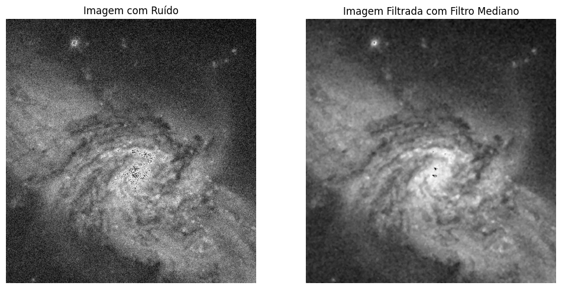
    


## Experimentos com Diferentes Tipos de Padding

Quando aplicamos filtros, o tratamento das bordas da imagem se torna uma questão importante. Para isso, utilizamos diferentes tipos de padding:

- ***Zero Padding***: Os pixels fora da imagem são preenchidos com zeros. Isso pode causar artefatos em bordas, pois a informação do pixel externo é zero.

- ***Replicate Padding***: Os pixels nas bordas são replicados. Isso ajuda a manter a informação da borda, mas pode causar uma transição abrupta se houver uma diferença de intensidade.

- ***Reflect Padding***: A imagem é espelhada nas bordas. Isso cria uma transição mais suave nas bordas e ajuda a preservar a informação, resultando em um tratamento mais natural.


```python
import numpy as np
import cv2
import matplotlib.pyplot as plt

def aplicar_filtro_arbitrario_padding(image, filter_matrix, padding_type='zero'):
    
    K = filter_matrix.shape[1] // 2
    L = filter_matrix.shape[0] // 2
    
    if padding_type == 'zero':
        padded_image = np.pad(image, [(L, L), (K, K)], mode='constant', constant_values=0)
    elif padding_type == 'replicate':
        padded_image = np.pad(image, [(L, L), (K, K)], mode='edge')
    elif padding_type == 'reflect':
        padded_image = np.pad(image, [(L, L), (K, K)], mode='reflect')
    else:
        raise ValueError("Tipo de padding inválido.")
    
    M, N = image.shape    
    filtered_image = np.zeros_like(image)
    
    scale_factor = 1.0 / np.sum(filter_matrix)

    for u in range(L, M + L):
        for v in range(K, N + K):            
            sum_result = 0
            for i in range(-K, K + 1):
                for j in range(-L, L + 1):
                    pixel_value = padded_image[u + j, v + i]                    
                    filter_value = filter_matrix[j + L, i + K]
                    sum_result += pixel_value * filter_value
            
            result = int(round(scale_factor * sum_result))
            result = np.clip(result, 0, 255)  
            filtered_image[u - L, v - K] = result
            
    return filtered_image


mean_matrix = np.array([
    [1/9, 1/9, 1/9],
    [1/9, 1/9, 1/9],
    [1/9, 1/9, 1/9]
])

filtered_image_zero_padding = aplicar_filtro_arbitrario_padding(noisy_image, mean_matrix, padding_type='zero')
filtered_image_replicate_padding = aplicar_filtro_arbitrario_padding(noisy_image, mean_matrix, padding_type='replicate')
filtered_image_reflect_padding = aplicar_filtro_arbitrario_padding(noisy_image, mean_matrix, padding_type='reflect')

plt.figure(figsize=(18, 12))
plt.subplot(1, 3, 1)
plt.title('Zero Padding')
plt.imshow(filtered_image_zero_padding, cmap='gray')
plt.axis('off')

plt.subplot(1, 3, 2)
plt.title('Replicate Padding')
plt.imshow(filtered_image_replicate_padding, cmap='gray')
plt.axis('off')

plt.subplot(1, 3, 3)
plt.title('Reflect Padding')
plt.imshow(filtered_image_reflect_padding, cmap='gray')
plt.axis('off')

plt.show()

```


    
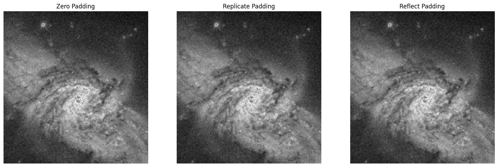
    


# Análise e Conclusões
Neste estudo, implementamos e analisamos diferentes tipos de filtros e técnicas de padding em imagens. Os filtros de média, gaussiano e laplaciano têm propósitos distintos e demonstraram eficácia na suavização e no aguçamento de imagens ruidosas. A escolha do método de padding pode influenciar significativamente os resultados finais e deve ser considerada ao aplicar filtros em imagens.
